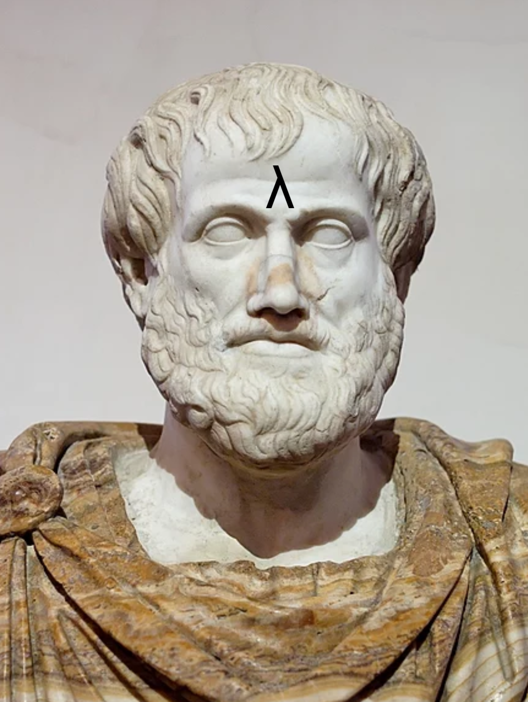

## Aristotelian syllogisms in Scala 3

("Aristotle with lambda tattoo")

  
It turns out that [Aristotle](https://en.wikipedia.org/wiki/Aristotle) was a functional programmer. This repository shows that 
we can formalize Aristotle's syllogisms using Scala 3. In particular, it shows how signatures built upon traits, algebraic data 
types and dependent types, allow us to model these logical arguments, and how type-driven development mimics the logical reasoning 
behind their corresponding proofs.

Full list of valid syllogisms (taken from [wikipedia](https://en.wikipedia.org/wiki/Syllogism#Types)):
[syllogisms](images/syllogisms.png)

Feel free to contribute!

